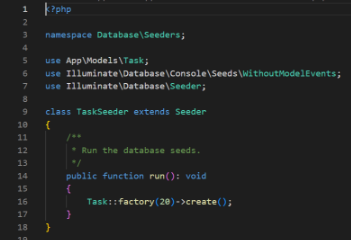

**Lucrarea de laborator nr. 3. Bazele lucrului cu baze de date în Laravel**

**Realizat:** Cotorobai Loredana

**Grupa:** IA2201

**Scopul lucrării**

Familiarizarea cu principiile de bază ale lucrului cu baze de date în Laravel. Învățarea creării de migrații, modele și seed-uri pe baza aplicației web To-Do App.

**Condiții**

În cadrul acestei lucrări de laborator, veți continua dezvoltarea aplicației To-Do App pentru echipe, începută în lucrările de laborator anterioare.

Veți adăuga funcționalitatea de lucru cu baza de date, veți crea modele și migrații, veți configura relațiile dintre modele și veți învăța să utilizați fabrici și seed-uri pentru generarea datelor de testare.

№1. Pregătirea pentru lucru

**TIP**

Tematici: S3

1. Instalați SGBD-ul MySQL, PostgreSQL sau SQLite pe calculatorul dumneavoastră.
1. Crearea bazei de date: Creați o nouă bază de date pentru aplicația dvs. **todo\_app**.
1. Configurați variabilele de mediu în fișierul .env pentru a vă conecta la baza de date:

   

   №2. Crearea modelelor și migrațiilor

   **TIP**

   Tematici: S6, S7

1. Creați modelul Category — categoria unei sarcini.

   

1. Definirea structurii tabelei **category** în migrație:
   1. Adăugați câmpuri:
      1. id — cheia primară;
      1. name — numele categoriei;
      1. description — descrierea categoriei;
      1. created\_at — data creării categoriei;
      1. updated\_at — data actualizării categoriei.

         Create\_categories\_table.php

         

1. Creați modelul Task — sarcina.

   

1. Definirea structurii tabelei **task** în migrație:
   1. Adăugați câmpuri:
      1. id — cheia primară;
      1. title — titlul sarcinii;
      1. description — descrierea sarcinii;
      1. created\_at — data creării sarcinii;
      1. updated\_at — data actualizării sarcinii.

         Create\_tasks\_table.php

         

1. Rulați migrarea pentru a crea tabelele în baza de date:

   

1. Creați modelul Tag — eticheta unei sarcini.

   

1. Definirea structurii tabelei **tag** în migrație:
   1. Adăugați câmpuri:
      1. id — cheia primară;
      1. name — numele etichetei;
      1. created\_at — data creării etichetei;
      1. updated\_at — data actualizării etichetei.

         Create\_tags\_table.php

         

1. Adăugați câmpul $fillable în modelele Task, Category și Tag pentru a permite atribuirea în masă a datelor.

   Category.php

   

   Task.php

   

   Tag.php

   

   №3. Relația dintre tabele

   **TIP**

   Tematici: S8

1. Creați o migrare pentru a adăuga câmpul category\_id în tabela **task**.
   1. Definiți structura câmpului category\_id și adăugați cheia externă pentru a face legătura cu tabela **category**.

      Category.php

      

      Task.php

      

1. Creați o tabelă intermediară pentru relația de tipul multe-la-multe dintre sarcini și etichete:

Adaug relatia in Task si Tag:

1. Rulați migrarea pentru a crea tabela în baza de date.

   

   №4. Relațiile dintre modele

   **TIP**

   Tematici: S8

1. Adăugați relații în modelul Category (O categorie poate avea multe sarcini)

   

1. Adăugați relații în modelul Task
   1. Sarcina este legată de o categorie.
   1. Sarcina poate avea multe etichete.

      

1. Adăugați relații în modelul Tag (O etichetă poate fi legată de multe sarcini).

   

   №5. Crearea fabricilor și seed-urilor

   **TIP**

   Tematici: S7, S8

1. Creați o fabrică pentru modelul Category:

   

   1. Definiți structura datelor pentru generarea categoriilor.

      

1. Creați o fabrică pentru modelul Task.

   

   

1. Creați o fabrică pentru modelul Tag.

   

1. Creați seed-uri pentru a popula tabelele cu date inițiale pentru modelele Category, Task, Tag.

   Seeduri:

   

   Category:

   

   Task:

   

   Tag:

   

1. Actualizați fișierul DatabaseSeeder pentru a lansa seed-urile și rulați-le:

   

   №6. Lucrul cu controlere și vizualizări

   **TIP**

   Tematici: S4, S5, S7, S8

1. Deschideți controlerul TaskController 

   

   

   

   

   

1. Actualizați metoda index pentru a obține lista sarcinilor din baza de date.

   

1. Actualizați metoda show pentru a afișa o sarcină individuală.

   

1. În metodele index și show, folosiți metoda with (**Eager Loading**) pentru a încărca modelele asociate.
1. Actualizați vizualizările corespunzătoare pentru a afișa lista de sarcini și o sarcină individuală.
1. Actualizați metoda create pentru a afișa formularul de creare a unei sarcini și metoda store pentru a salva o sarcină nouă în baza de date.
1. Actualizați metoda edit pentru a afișa formularul de editare a unei sarcini și metoda update pentru a salva modificările în baza de date.
1. Actualizați metoda destroy pentru a șterge o sarcină din baza de date.

   **Întrebări de control**

1. Ce sunt migrațiile și la ce se folosesc?

   **Migrațiile** sunt fișiere care conțin instrucțiuni pentru crearea și modificarea structurilor tabelelor dintr-o bază de date. Ele sunt folosite pentru a sincroniza schema bazei de date cu modelul aplicației, asigurându-se că modificările sunt consistente și ușor de gestionat pe parcursul dezvoltării.

1. Ce sunt fabricile și seed-urile și cum simplifică procesul de dezvoltare și testare?

   **Fabricile** sunt folosite pentru a genera date de test într-un mod automatizat, iar **seed-urile** sunt folosite pentru a popula baza de date cu aceste date de test. Ele simplifică dezvoltarea și testarea, deoarece permit crearea rapidă a unui set de date pentru a valida funcționalitatea aplicației fără a fi nevoie să le adaugi manual.

1. Ce este ORM? Care sunt diferențele dintre pattern-urile DataMapper și ActiveRecord?

   **ORM** (Object-Relational Mapping) este o tehnică ce permite interacționarea cu o bază de date relațională folosind obiecte în limbaje de programare orientate pe obiect. **DataMapper** și **ActiveRecord** sunt două tipuri de modele ORM: **DataMapper** separă logica de bază de date de obiectele aplicației, în timp ce **ActiveRecord** combină aceste două responsabilități, gestionând atât datele cât și logica de salvare a acestora.

1. Care sunt avantajele utilizării unui ORM comparativ cu interogările SQL directe?

   **Avantajele utilizării unui ORM** sunt multiple: codul devine mai curat și mai ușor de întreținut, deoarece ORM-ul gestionează interogările SQL pentru noi. De asemenea, permite lucrul cu date într-o manieră orientată pe obiect, evitând nevoia de a scrie SQL manual, ceea ce poate duce la mai puține erori și mai multă productivitate.

1. Ce sunt tranzacțiile și de ce sunt importante în lucrul cu bazele de date?

   **Tranzacțiile** sunt seturi de operațiuni pe care le efectuăm asupra bazei de date care trebuie să fie finalizate cu succes sau anulate complet dacă apar erori. Ele sunt importante deoarece garantează integritatea datelor: dacă o operațiune nu poate fi finalizată corect, toate schimbările sunt anulate, evitând astfel date incorecte sau incomplete.

